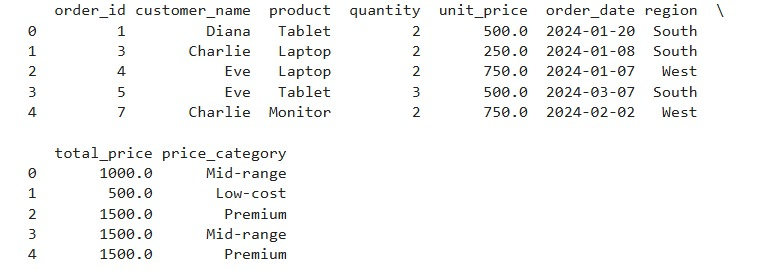
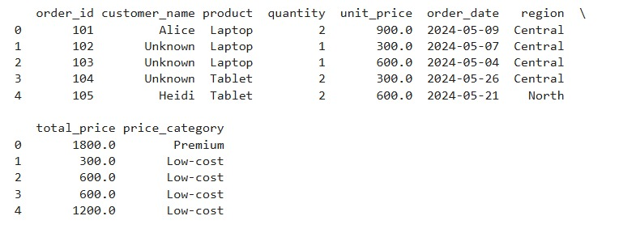
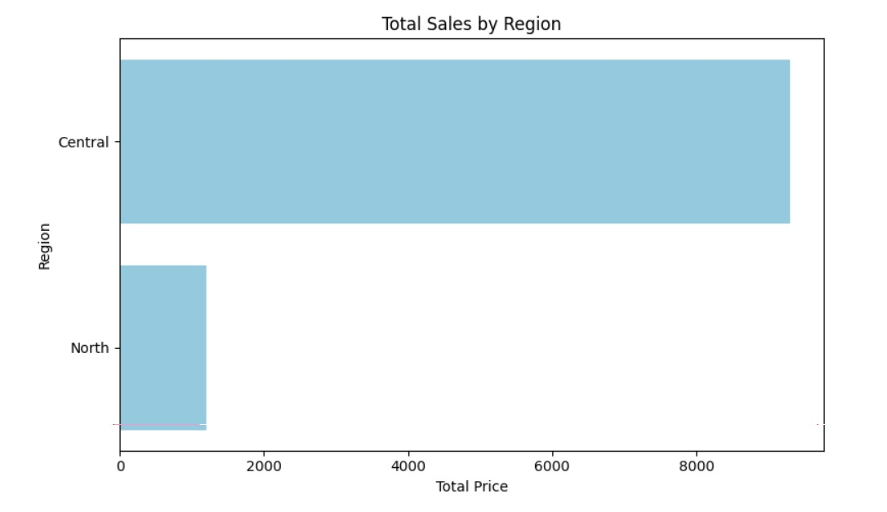

# ETL_Midterm_Hana_555-
This repository contains my mid-semester project for the Data Warehousing course, focusing on the ETL (Extract, Transform, Load) process
---

## Table of Contents
- [Project_Overview](#1.Project_Overview)  
- [ETL_Phases](#2.ETL_Phases )  
- [Tools_Used](#3.Tools_Used)  
- [How_to_Run_the_Project_Step-by-step Instructions](#4.How_to_Run_the_Project_Step_by_step_Instructions)  
- [Screenshoots_of_Data_and_Chart](#5.Screenshoots_of_Data_and_Chart)   
---
## 1.Project_Overview 

This ETL (Extract, Transform, Load) lab demonstrates the complete process of preparing retail data for analysis. The lab walks through:

- **Extraction** of raw retail data from a CSV source.
- **Transformation** through data cleaning, structural adjustments, enrichment (e.g., new calculated columns), and categorization (e.g., product price tiers).
- **Loading** of the final transformed dataset into storage Parquet format.

The primary goal is to practice essential ETL techniques, and to produce clean, structured data suitable for further analysis or reporting.

## 2. ETL_Phases 

This project is divided into three ETL phases, each handled in a separate Jupyter Notebook:

---

### 📥 1. `etl_extract.ipynb` – Data Extraction

**Purpose:** Extract and inspect retail transaction records from CSV files.

**Tasks Completed:**
- Imported the `raw_data.csv` and `incremental_data.csv` datasets using `pandas`.
- Inspected the structure of each dataset using `.head()`, `.info()`, and `.describe()`.
- Identified and reported:
  - Missing values in key columns such as `customer_name`, `quantity`, `unit_price`, `order_date`, and `region`.
  - Duplicate records (1 duplicate found in `raw_data.csv`; none in `incremental_data.csv`).
  - Anomalies in numeric columns (e.g., suspiciously low `unit_price` values).
- Exported both datasets for use in the next transformation phase.

---

### 🛠️ 2. `etl_transform.ipynb` – Data Transformation

**Purpose:** Clean, structure, enrich, and categorize the extracted data.

**Tasks Completed:**
- **Cleaning:**
  - Removed duplicates and handled missing values.
- **Structural Transformation:**
  - Converted data types: e.g., `order_id` to string, `order_date` to datetime, and categorical encoding for `product` and `region`.
- **Enrichment:**
  - Created a new column `total_price = quantity × unit_price`.
- **Categorization:**
  - Created product pricing bins (`Low-cost`, `Mid-range`, `Premium`) using unit price percentiles.

---

### 3. `etl_load.ipynb` – Data Loading

**Purpose:** Save the final transformed datasets in a queryable and efficient format.

**Tasks Completed:**
- Loaded transformed datasets into:
  - **Parquet format** using `pandas.to_parquet()`.
- Verified successful storage by previewing:
  - First five rows using `pd.read_parquet(...).head()`
- Saved outputs to the `loaded/` directory for future analysis.

---

Together, these notebooks demonstrate a full ETL pipeline applied to retail transaction data.

## 🛠️ 3.Tools_Used

The following tools and technologies were used throughout the ETL process:

| Tool/Library         | Purpose                                                      |
|----------------------|--------------------------------------------------------------|
| **Python**           | Core programming language for data processing                |
| **pandas**           | Data manipulation, cleaning, transformation, and loading     |
| **matplotlib**       | Basic data visualization                                     |
| **seaborn**          | Enhanced statistical data visualization                      |
| **Jupyter Notebook** | Interactive environment for building and documenting ETL     |
| **Parquet**          | Efficient columnar file format for storing transformed data  |
| **CSV**              | Original format of raw and incremental data files            |

##  4.How_to_Run_the_Project_Step-by-step Instructions

### 📁 Prerequisites

Ensure Python 3.x is installed on your system. You will also need the following Python libraries:

```bash
pip install pandas matplotlib seaborn pyarrow 
```
---

### 🧭 Step-by-Step Execution

1. **Clone the Repository**

   Clone this project repository to your local machine:

   ```bash
   git clone https://github.com/your-username/etl-project.git
   cd etl-project
   ```

2. **Launch Jupyter Notebook**

   Open the project in Jupyter Notebook:

   ```bash
   jupyter notebook
   ```

3. **Run the ETL Notebooks in Sequence**

   * **`etl_extract.ipynb`**
     * Reads the raw and incremental datasets (`raw_data.csv` and `incremental_data.csv`)
     * Performs inspection (missing values, duplicates, data summary)

   * **`etl_transform.ipynb`**
     * Cleans and preprocesses data
     * Adds `total_price` column
     * Categorizes unit prices into **Low-cost**, **Mid-range**, **Premium**

   * **`etl_load.ipynb`**
     * Saves the final transformed data to:
       * **Parquet files** (`.parquet`) using `pandas.to_parquet()`
       * **SQLite database** using `sqlite3` or `SQLAlchemy`

4. **Preview the Loaded Data**

     ```python
     pd.read_parquet('loaded/full_data.parquet').head()
     ```
---

###  Output Files

All transformed  files will be saved in the `transformed/` directory:
* `transformed_full.csv`
* * `transformed_incremental.csv`

All loaded files will be saved in the `loaded/` directory:

* `full_data.parquet`
* `incremental_data.parquet`

---

✅ The ETL pipeline is now ready for downstream analytics or dashboard development!

## 5.Screenshoots_of_Data_and_Chart

### **Preview of Loaded Data**

### Full Data


### Incremental Data


---

### **Visualization:Total Sales by Region**

- All visualizations were generated in the `Visualizations.ipynb` notebook.
- The main focus was to explore and compare **total sales by region** for both the full and incremental datasets.
  
### Full Data Chart


### 📈 Insight: Total Sales by Region

🥇 **South** region had the highest total sales, indicating it may be the most profitable or has the most customer activity.  
🥈 **West** region followed as the second-highest contributor in total sales.  
🥉 **North** region came in third, suggesting moderate sales performance.  
🧭 **East** region recorded the lowest total sales, indicating either lower demand, fewer transactions, or potential for growth.

🔎 **This distribution could inform strategic decisions such as:**

- Increasing marketing efforts in the **East**.
- Creating additional branch locations in the **South**.
- Investigating why the **South** performs better—product mix, customer base, etc.


### Incremental Data Chart


### 📊 Insight: Total Sales by Region of Transformed Incremental Data

🏆 In the incremental data, only the **Central** and **Northern** regions were present.  
💰 The **Central** region had significantly higher total sales — **above 8000**.  
🌬 The **Northern** region had much lower sales — **less than 2000**.  
🔍 This indicates a strong concentration of high-value transactions in the **Central** region, suggesting a possible business focus or higher purchasing activity there.


